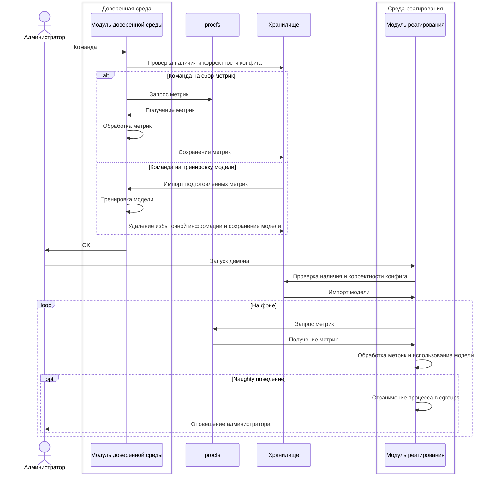

# cgjail

> Двумодульная программа, производящая мониторинг процессов, обнаружение аномальных паттернов поведения и противодействующая угрозам ИБ путем динамической настройки параметров cgroup для аномальных процессов 



# Конфигурационный файл
Оба модуля управляются с помощью конфигурационного файла `cgjailConfig.toml`, содержащего поля `model_storage` для указания доверенного хранилища для моделей, а также `debug` для отладки
```
model_storage = "/home/models"
debug = false
```

# Доверенный модуль
Администратор запускает доверенный модуль в одном из двух режимов:
- режим сбора метрик
- режим тренировки модели

В режиме сбора метрик администратор сначала делает запуск модуля для допустимого поведения процесса, а потом аномального. В контексте разработанного программного средства допустимое поведение называется docile, а потенциально опасное и аномальное – naughty. Поэтому режим сбора данных соответственно делится на docile и naughty.

Режим тренировки назван train. Во время этого режима происходит обучение модели на собранных данных по алгоритму k-ближайших соседей. В качестве функции расстояния выбрано манхэттенское расстояние, поскольку размерность собранных данных больше двух. Кроме этого, количество метрик возможно будет увеличить без изменения параметров самой модели.

## Запуск

| Режим работы | Опции | Описание |
|---|---|---|
|docile, naughty| -p, --pid | Идентификатор процесса |
|docile, naughty| | Период опроса |
|docile, naughty| | Количество точек данных для
записи |
|naughty| -o, --output | Файл формата csv для временного
хранения метрик |
| train | -i, --input | Файл формата csv для временного
хранения метрик |
| train | -k, --k-neighbour | Значение k для метода kближайших соседей | 
| train | -c, --clean | Удаление избыточной информации
из хранилища |

Запуск всех режимов поэтапно:
```
python3 reliability.py docile -p <PID>
python3 reliability.py naughty -p <PID> -o <файл>
python3 reliability.py train -i <файл>

```

# Модуль реагирования 
Модуль реагирования исполнен в виде демона, чтобы производить
непрерывный мониторинг процессов, а также реагирование на потенциальную
угрозу информационной безопасности в реальном времени.

Выше приведена диаграмма последовательности для модуля реагирования. Администратор запускает модуль в качестве демона. Далее,модуль реагирования загружает натренированные ранее доверенным модулем модели и начинает процесс мониторинга процессов. Модуль реагирования самостоятельно выбирает процессы для мониторинга, основываясь на доступных ему моделях. Как только модуль реагирования замечает аномальный процесс, то он создает для него персонализированную контрольную группу с названием <process_name>_jail, настраивает контроллеры ресурсов исходя из модели и помещает туда процесс.

## Запуск 

```
cargo run
```

Или же в качестве демона ОС Linux с помощью Unit-файла:
```
[Unit]
Description=cgjail

[Service]
Type=simple
WorkingDirectory=/cgjail/repercussion

User=root
Group=root

OOMScoreAdjust=-1000

ExecStart=/cgjail/repercussion/target/debug/repercussion
ExecStop=systemctl kill cgjail.service
ExecReload=systemctl kill cgjail.service && /cgjail/repercussion/target/debug/repercussion
TimeoutSec=300
```

И запустить:
```
sudo systemctl start cgjail
```
